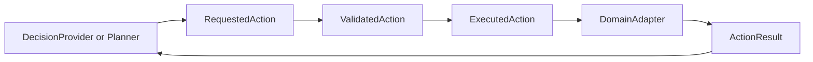

# Action Model

The action model separates decision intent from runtime execution. This
document is design only and does not implement validation, execution,
`step`, or a Rogue action API.

## Action Flow

## Action Definitions

`RequestedAction`:

- what a DecisionProvider, planner, human, or recorded decision asks for,
- may be malformed, unsupported, too abstract, or impossible,
- must not be applied directly to the DomainAdapter.

`ValidatedAction`:

- a RequestedAction that passed schema and observable legality checks,
- does not guarantee success after execution,
- must not be validated using hidden future information.

`ExecutedAction`:

- the concrete action submitted to the DomainAdapter,
- represents one semantic runtime turn in the Phase 7 profile,
- must be recorded for Level 1 deterministic replay.

`ActionResult`:

- the outcome after the DomainAdapter attempts the ExecutedAction,
- may report success, in-domain failure, no-op, terminal result, or
  error,
- is the correct place to report a game or domain action failure.

## Validation Levels

Syntactic validation:

- checks schema version,
- checks required fields,
- checks enum values,
- checks type and range constraints.

Observable legality:

- checks what appears possible from AgentObservation,
- checks actor state and resources,
- checks public action grammar,
- must not reveal hidden state.

Execution result:

- reports the actual outcome after attempting the action,
- may reveal newly observed facts that the actor would learn by trying.

## Hidden State Policy

Validation must not reveal:

- undiscovered traps,
- hidden doors,
- unseen enemies,
- future combat results,
- future random outcomes,
- true identity of unknown items,
- device-private debug flags.

The runtime may allow actions that later fail. For example, searching may
find nothing, movement may be blocked, or a device command may be refused
after execution.

## Result Categories

Minimum result categories:

- `succeeded`,
- `failed_in_domain`,
- `rejected_by_schema`,
- `rejected_by_observable_legality`,
- `timed_out`,
- `provider_error`,
- `communication_error`,
- `runtime_error`,
- `terminal`.

Grammar-invalid actions and attempted-but-failed in-domain actions must
remain separate.

## Action Open Questions

- Should actions be semantic, key-like, or both?
- Should action validation return ranked alternatives?
- Should `observable_legal_actions` list all possible actions or only
  common safe actions?
- How should continuous robot actions be bounded in a future profile?
