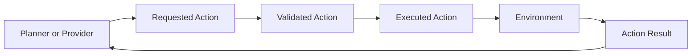

# Action Model

The action model separates provider intent from runtime execution. This
document is design only and does not implement validation, execution,
`step`, or a Rogue action API.

## Action Flow

## Action Definitions

Requested Action:

- What a provider, human, planner, or replay source asks the runtime to
  do.
- May be malformed, unsupported, too abstract, or impossible.
- Must not be applied directly to the Game Core.

Validated Action:

- A requested action that passed schema and observable legality checks.
- Does not guarantee success after execution.
- Must not be validated using hidden future information.

Executed Action:

- The concrete action submitted to the Environment or Game Core.
- Represents one runtime step or one domain operation.
- Must be recorded for replay.

Action Result:

- The outcome after the runtime attempts the executed action.
- May report success, failure, no-op, terminal result, or error.
- Is the correct place to report in-game or in-domain failure.

## Validation Levels

Syntactic Validation:

- Checks schema version.
- Checks required fields.
- Checks enum values.
- Checks type and range constraints.

Observable Legality:

- Checks what appears possible from current observation, actor state,
  inventory, public grammar, and runtime state.
- Must not reveal hidden state.

Execution Result:

- Reports the actual outcome after attempting the action.
- May reveal newly observed facts that the actor would learn by trying.

## Hidden State Policy

Validation must not reveal:

- undiscovered traps,
- hidden doors,
- unseen enemies,
- future combat results,
- future random outcomes,
- true identity of unknown items,
- device-private debug flags.

The runtime may allow actions that later fail. For example, searching may
find nothing, movement may be blocked, or a device command may be refused
after execution.

## Action Result Categories

Minimum result categories:

- `succeeded`,
- `failed_in_domain`,
- `rejected_by_schema`,
- `rejected_by_observable_legality`,
- `timed_out`,
- `provider_error`,
- `communication_error`,
- `runtime_error`,
- `terminal`.

## Executor Responsibilities

The Action Executor should:

- convert plans into one action at a time,
- maintain path or retry context,
- reject malformed provider output,
- choose fallback actions when policy allows,
- record validation decisions,
- preserve deterministic ordering.

The executor should not:

- inspect privileged debug state for normal action selection,
- change domain rules,
- hide provider errors,
- execute multi-turn plans atomically unless a domain adapter explicitly
  supports that mode.

## Action Open Questions

- Should actions be semantic, key-like, or both?
- How should multi-agent actions be represented?
- Should action validation return ranked alternatives?
- Should `observable_legal_actions` list all possible actions or only
  common safe actions?
- How should continuous robot actions be bounded and discretized?
