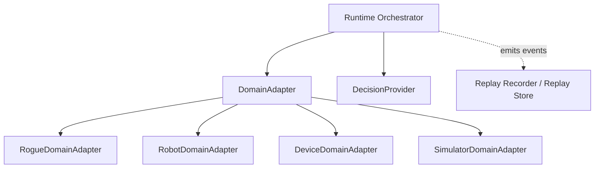

# Future Extension

The NaMMA Runtime should be designed so future domains can be added
without rewriting Runtime Orchestrator, DecisionProvider, replay, or the
state machine. Phase 7 will still implement only the Rogue single-actor
profile.

## Future Domain Candidates

Future candidates may include:

- NetHack,
- Minecraft,
- ROS2,
- robots,
- Accuvision,
- simulators,
- distributed runtime,
- cloud provider,
- training.

These are not Phase 7 implementation targets.

## Domain Adapter Families

Future domains should enter through DomainAdapter implementations:

- `GameDomainAdapter`,
- `RobotDomainAdapter`,
- `DeviceDomainAdapter`,
- `SimulatorDomainAdapter`.

The runtime should not use provider terminology for these boundaries.

## Extension Architecture

## Future DecisionProvider Candidates

Future decision implementations may include:

- richer LLM providers,
- NaMMA hardware transports,
- cloud-hosted planners,
- recorded decision playback,
- rule-based baselines.

They should still satisfy the DecisionProvider interface.

## Not Required In Phase 7

Phase 7 should not require these capabilities:

- multi-agent,
- streaming DecisionProvider responses,
- batch DecisionProvider calls,
- continuous action,
- real-time guarantees,
- distributed execution,
- cloud provider support,
- training pipeline support.

They may remain future extension points.

## Stable Design Points

These should be hard to change after implementation starts:

- separation of DomainState, AgentObservation, PrivilegedDebugState, and
  EpisodeMemory,
- Runtime Orchestrator ownership of episode progression,
- DomainAdapter boundary,
- DecisionProvider request and response envelope,
- replay responsibility split,
- RuntimeState and EpisodeOutcome separation,
- Determinism Context identity.

## Flexible Design Points

These should remain easy to change:

- observation payload format,
- replay binary format,
- compression method,
- NaMMA transport,
- DecisionProvider model names,
- snapshot interval,
- future capabilities.

## Extension Open Questions

- Should multi-agent support be a separate runtime profile?
- Should remote runtimes use one replay writer or replicated writers?
- How should simulated time and wall-clock time be represented?
- What is the minimum shared interface for robots and games?
- Should hardware capability discovery be pull-based or push-based?
