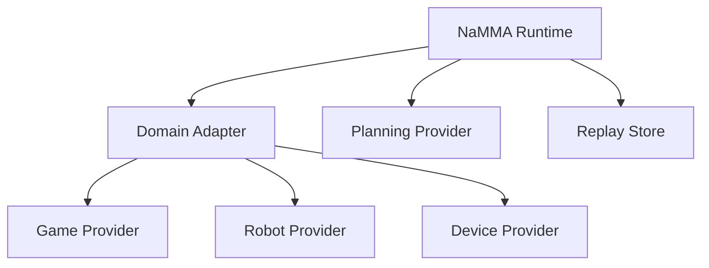

# Future Extension

The NaMMA Runtime should be designed so future targets can be added
without rewriting the provider interface, replay model, or state machine.
This document records extension points and design pressure.

## Extension Targets

Multi Agent:

- Multiple planners or actors in one episode.
- Shared or separate episode memories.
- Conflict resolution and action arbitration.

Multi Game:

- Rogue, NetHack, Minecraft, and future game adapters.
- Domain-specific observations mapped into a common runtime envelope.

Remote Runtime:

- Game Core or simulator runs on another machine.
- Runtime keeps the same provider and replay boundary.

Cloud Provider:

- LLM or planning provider runs outside the local machine.
- Provider interface should remain the same as local providers.

FPGA Runtime:

- NaMMA or other FPGA components provide planning or acceleration.
- Transport details remain below provider capability negotiation.

Simulation:

- ROS2, robot simulators, or hardware-in-the-loop environments.
- Real-time and simulated-time policies must be explicit.

Training:

- High-volume episode execution.
- Dataset extraction.
- Offline provider comparison.

## Extension Architecture

Domain adapters should absorb target-specific details. The runtime
should keep a stable control envelope around observations, actions,
providers, replay, errors, and timing.

## Stable Design Points

These should be hard to change after implementation starts:

- separation of Game State, Observation, Debug State, and Episode
  Memory,
- provider request and response envelope,
- runtime state machine,
- replay metadata and seed identity,
- error category vocabulary,
- transport independence for NaMMA.

## Flexible Design Points

These should remain easy to change:

- observation payload format,
- replay binary format,
- compression method,
- provider transport,
- provider model names,
- snapshot interval,
- performance counters,
- domain-specific action details.

## Extension Risks

- A Rogue-specific observation schema could make NetHack or robots hard
  to support.
- Transport-specific NaMMA assumptions could make Ethernet and OCuLink
  diverge.
- Replay designed only for games may fail for real devices.
- Hidden debug state can accidentally become training data or provider
  input if not separated early.
- Multi-agent arbitration may require action model changes.

## Future Work Not In Phase 6

- Implementation of runtime classes or services.
- Headless Rogue API.
- `reset` or `step`.
- Replay file format.
- Observation schema implementation.
- Provider client implementation.
- NaMMA transport implementation.
- GUI or viewer.
- 64x160 display support.
- Training pipeline.

## Extension Open Questions

- Should multi-agent support be part of the first runtime schema?
- Should remote runtimes use the same replay writer or a replicated one?
- How should simulated time and wall-clock time be represented?
- What is the minimum shared interface for robots and games?
- Should hardware capability discovery be pull-based or push-based?
