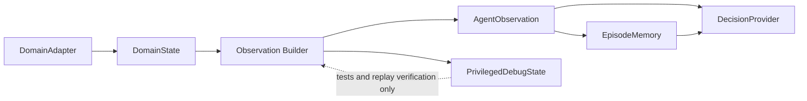

# Observation Model

Observation is the DecisionProvider-facing view of the current episode
state. It is not the same as the full domain state and it is not the
same as the agent's memory.

This document is design only. It does not implement observation
generation or schemas.

## Core Boundaries

`DomainState`:

- authoritative state exposed by the DomainAdapter,
- derived from Domain Core internals,
- may include information that is not visible to the actor,
- never sent directly to normal DecisionProviders.

`AgentObservation`:

- redacted current view built by the Observation Builder,
- contains information available under visibility rules,
- is the normal input to Human, RuleBased, LLM, and NaMMA
  DecisionProviders.

`PrivilegedDebugState`:

- diagnostic view for tests, invariant checks, and replay verification,
- may include complete domain internals,
- never sent to normal Human, RuleBased, LLM, or NaMMA
  DecisionProviders.

`EpisodeMemory`:

- agent-side remembered context,
- built from AgentObservation and ActionResult history,
- may be stale or incomplete,
- is not authoritative domain state.

## Observation Boundary Diagram

The dotted debug path is not a normal planning path.

## AgentObservation Content

Common fields:

- schema version,
- episode ID,
- turn,
- runtime state,
- objective or task phase,
- visible domain state,
- actor state,
- inventory or resources when applicable,
- equipment or attached tools when applicable,
- recent messages or events,
- observable legal actions,
- terminal status,
- timing budget.

For Rogue, visible domain state later maps to visible map cells,
monsters, items, player state, inventory, equipment, messages, and
observable legal actions.

For robots or devices, the same concept may map to sensor readings,
simulator state, joint status, actuator status, or device telemetry.

## Hidden Information Rules

AgentObservation must not reveal:

- unseen map topology,
- hidden traps,
- secret doors,
- unseen enemies,
- future random outcomes,
- exact hidden item identity,
- full simulator internals,
- hardware debug state,
- provider-private diagnostics.

Observable legal actions must be generated from:

- visible information,
- current actor state,
- current inventory or tools,
- public action grammar,
- schema rules.

It is acceptable for an action to fail after execution. The failure
belongs in `ActionResult`, not in hidden information leaked before
execution.

## EpisodeMemory Content

Example memory fields:

- known map or known world model,
- visited states,
- known objectives,
- known resources,
- previously observed entities,
- level or scene history,
- current plan,
- failed targets,
- loop history,
- provider notes.

EpisodeMemory is owned by the agent side of the runtime.

## Observation Open Questions

- Observation Format.
- Field naming convention.
- Whether observations should be canonical JSON.
- Whether compact summaries and full observations share one schema.
- How to represent real robot sensor uncertainty.
- How much EpisodeMemory should be sent by default.
