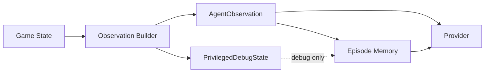

# Observation Model

Observation is the agent-facing view of the current episode state. It is
not the same as the full game or device state, and it is not the same as
the agent's memory.

This document is design only. It does not implement observation
generation or schemas.

## Core Definitions

Game State:

- Authoritative internal state owned by the Game Core or device adapter.
- May include hidden traps, unseen enemies, RNG state, private flags,
  simulator internals, or hardware state.
- Not sent to normal providers.

Observation:

- Current agent-facing view produced by the Observation Builder.
- Contains only information available under the runtime visibility
  rules.
- May include legal action summaries that do not reveal hidden state.

Debug State:

- Privileged diagnostic view used for tests, replay validation, and
  debugging.
- May include complete internal state.
- Not sent to Human, Rule Based, LLM, NaMMA, or Replay providers during
  normal operation.

Episode Memory:

- Agent-owned remembered context built from past observations and action
  results.
- Not authoritative game state.
- May be stale or wrong.

## Observation Boundary

The dotted path is not allowed for normal operation. Debug state may be
used by tests and replay tooling, but not by normal planning providers.

## AgentObservation Content

Common fields:

- schema version,
- episode ID,
- turn,
- runtime state,
- objective or task phase,
- visible world or device state,
- actor state,
- inventory or resources when applicable,
- equipment or attached tools when applicable,
- recent messages or events,
- observable legal actions,
- terminal status,
- timing budget.

For Rogue, visible world state later maps to visible map cells,
monsters, items, player state, inventory, equipment, messages, and
observable legal actions. For other domains, the same concept may map to
sensor readings, simulator state, robot joint status, or device telemetry.

## Hidden Information Rules

Observation must not reveal:

- unseen map topology,
- hidden traps,
- secret doors,
- unseen enemies,
- future random outcomes,
- exact hidden item identity,
- full simulator state,
- hardware debug state,
- provider-private diagnostics.

Observable legal actions must be generated from:

- visible information,
- current actor state,
- current inventory or tools,
- public action grammar,
- schema rules.

It is acceptable for an action to fail after execution. The failure
should appear in `ActionResult`, not as hidden information leaked before
execution.

## Episode Memory Content

Example memory fields:

- known map or known world model,
- visited states,
- known objectives,
- known resources,
- previously observed entities,
- level or scene history,
- current plan,
- failed targets,
- loop history,
- provider notes.

Episode Memory is owned by the agent side of the runtime. It is not
owned by the Game Core or Environment.

## Debug State Content

Debug state may include:

- complete map or simulator state,
- hidden entities,
- raw RNG state,
- exact object identities,
- internal device flags,
- invariant check results,
- checksums.

Debug state must be labeled and access-controlled at the runtime level.
It may be recorded in diagnostic replay if configured.

## Observation Open Questions

- Observation Format.
- Field naming convention.
- Whether observations should be canonical JSON.
- Whether compact summaries and full observations share one schema.
- How to represent real robot sensor uncertainty.
- How much memory should be included in provider requests.
