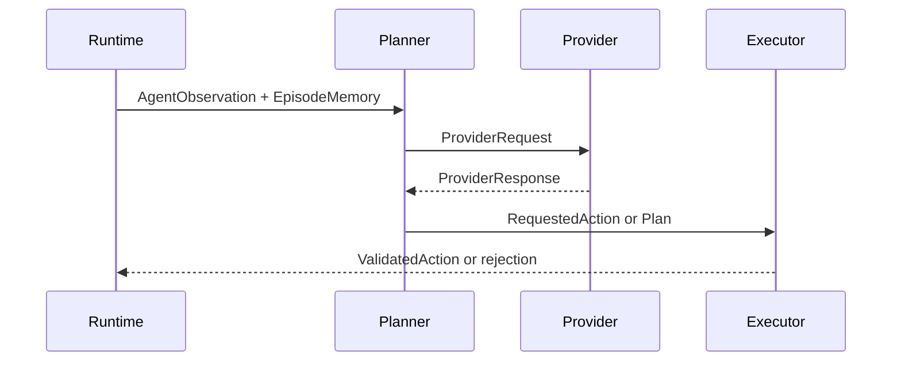

# Provider Interface

The provider interface lets Human, Rule Based, LLM, NaMMA, and Replay
decision sources plug into the same runtime. This document defines the
application-level contract only. It does not implement a provider,
transport, client, server, driver, or protocol.

## Provider Types

Human:

- Receives an observation through a UI or terminal.
- Returns a requested action or plan selected by a person.

Rule Based:

- Uses deterministic program logic.
- Useful as a baseline and as a fallback provider.

LLM:

- Uses a model server or local model runtime.
- May return structured plans, explanations, or semantic actions.

NaMMA:

- Uses NaMMA hardware or firmware through an abstract transport.
- Ethernet, OCuLink, PCIe, and future paths are below this interface.

Replay:

- Reads recorded decisions or actions.
- Useful for deterministic replay and regression checks.

## Common Provider Flow

## Provider Request

Common fields:

- `request_id`
- `schema_version`
- `episode_id`
- `turn`
- `provider_type`
- `task`
- `agent_observation`
- `episode_memory_summary`
- `action_space_summary`
- `runtime_state`
- `timeout_ms`
- `capability_requirements`
- `replay_metadata`
- `debug_request_id`

The request must not contain `PrivilegedDebugState` unless the provider
is explicitly a debug tool outside normal agent operation.

## Provider Response

Common fields:

- `request_id`
- `schema_version`
- `status`
- `requested_action`
- `plan`
- `confidence`
- `diagnostics`
- `usage`
- `latency_ms`
- `capabilities_used`
- `error`

Valid response statuses:

- `ok`
- `no_action`
- `invalid_request`
- `timeout`
- `unavailable`
- `unsupported_capability`
- `internal_error`

## Capability Model

Capabilities should be explicit so the planner can choose providers
without hard-coding transport details.

Example capability categories:

- max observation size,
- structured action support,
- plan support,
- streaming response support,
- deterministic output support,
- maximum timeout,
- transport type,
- hardware acceleration status,
- batch support,
- replay support.

## Timeout Semantics

Timeout is part of the request and response contract:

- The runtime provides a timeout budget.
- The provider should stop work when the budget expires.
- The runtime may abort the request if the provider cannot stop itself.
- A timeout is reported as a provider error unless policy allows a
  fallback action.

## Error Semantics

Provider errors must be structured and must not be confused with game
errors.

Provider Error:

- invalid provider output,
- timeout,
- model unavailable,
- unsupported capability,
- malformed response.

Communication Error:

- transport failure,
- connection reset,
- device not present,
- protocol framing error.

Internal Error:

- provider adapter bug,
- serialization bug,
- schema mismatch.

## NaMMA Interface

NaMMA is a provider, not a special planner path. The runtime decides only
these application-level concepts:

Request:

- Same common provider request shape.
- May include compact observation or memory summaries if required by
  capability limits.

Response:

- Same common provider response shape.
- Must return a plan, requested action, or explicit no-action status.

Timeout:

- Request-scoped and reported as a provider or communication error.

Error:

- Split into provider, communication, and internal categories.

Capability:

- Reported through the same capability mechanism as other providers.

Transport remains undecided:

- Ethernet,
- OCuLink,
- PCIe,
- shared memory,
- future local bus or network links.

Transport must not change the application-level request and response
meaning.

## Provider Open Questions

- Should provider responses allow multiple ranked actions?
- Should streaming partial plans be supported in Phase 1?
- What is the minimum common capability set?
- How much `EpisodeMemory` should be sent by default?
- Should provider diagnostics be recorded in replay by default?
