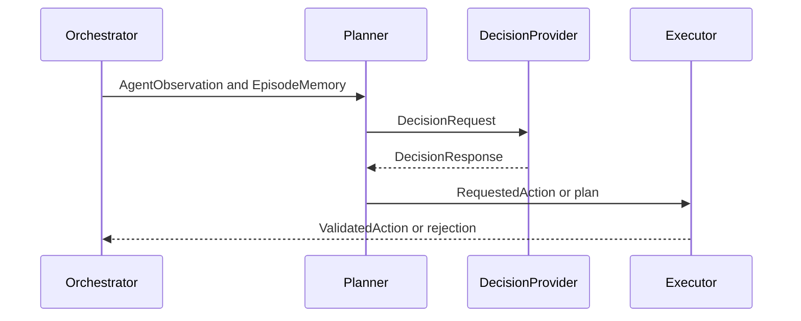

# DecisionProvider Interface

The runtime uses `DecisionProvider` for anything that returns decisions.
This document defines the application-level contract only. It does not
implement Human, RuleBased, LLM, NaMMA, Recorded, transport, client,
server, driver, or protocol code.

## DecisionProvider Implementations

Human:

- `HumanDecisionProvider`
- Returns decisions selected by a person.

Rule based:

- `RuleBasedDecisionProvider`
- Uses deterministic program logic.
- May return a RequestedAction directly without a separate Planner step.

LLM:

- `LLMDecisionProvider`
- Uses a model server or local model runtime.
- May return structured plans, explanations, or semantic actions.

NaMMA:

- `NammaDecisionProvider`
- Uses NaMMA hardware or firmware.
- Hides Ethernet, OCuLink, PCIe, and future links behind transport
  adapters.

Recorded:

- `RecordedDecisionProvider`
- Returns previously recorded decision results.
- Is useful for deterministic comparison of decision behavior.

## Common Decision Flow

## Minimal Request

Initial required fields:

- request ID,
- schema version,
- episode ID,
- turn,
- task,
- AgentObservation,
- allowed action schema,
- timeout budget.

Optional fields:

- EpisodeMemory summary,
- plan context,
- capability requirements,
- replay correlation ID,
- diagnostics request.

`PrivilegedDebugState` must not be included in normal requests.

`debug_request_id` must not be required.

## Response

Common fields:

- request ID,
- schema version,
- status,
- requested action,
- plan,
- diagnostics,
- usage,
- latency,
- error.

Valid response statuses:

- `ok`,
- `no_action`,
- `invalid_request`,
- `timeout`,
- `unavailable`,
- `unsupported_capability`,
- `internal_error`.

## Capability Model

Capability reporting is optional at first, but the interface should allow
it later.

Example capabilities:

- maximum observation size,
- structured action support,
- plan support,
- deterministic output support,
- maximum timeout,
- transport type,
- hardware acceleration status.

Streaming, batch, multi-agent, continuous action, real-time guarantees,
and distributed execution are future capabilities. They are not required
for the Phase 7 initial profile.

## Timeout Semantics

Timeout is part of the DecisionRequest contract:

- The Runtime Orchestrator provides a timeout budget.
- The DecisionProvider should stop work when the budget expires.
- The runtime may abort the request if the provider cannot stop itself.
- The result is an explicit error or a configured fallback.
- The runtime must never silently reuse stale provider output.

## Error Semantics

DecisionProvider errors:

- invalid provider output,
- timeout,
- model unavailable,
- unsupported capability,
- malformed response.

Communication errors:

- transport failure,
- connection reset,
- device not present,
- protocol framing error.

Internal errors:

- provider adapter bug,
- serialization bug,
- schema mismatch.

## NaMMA Transport Boundary

NaMMA is represented as `NammaDecisionProvider`.

Transport adapters below it may include:

- Ethernet,
- OCuLink,
- PCIe,
- shared memory,
- future local bus or network links.

Transport must not change the application-level DecisionRequest and
DecisionResponse meaning.

## Provider Open Questions

- Should responses allow multiple ranked actions?
- What is the minimum common capability set?
- How much EpisodeMemory should be sent by default?
- Should provider diagnostics be recorded in replay by default?
- Which transport should `NammaDecisionProvider` use first?
