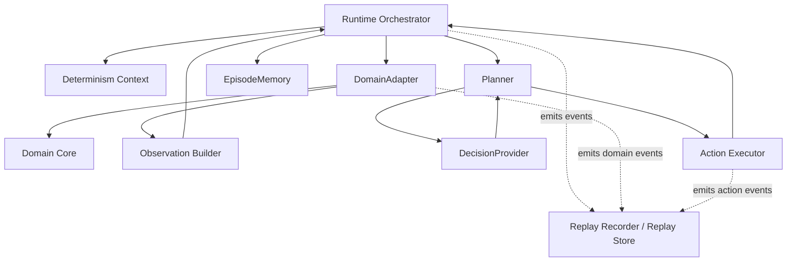

# NaMMA Runtime Architecture

Phase 6 defines the NaMMA Runtime as a domain-independent control
architecture. Rogue is the first implementation target, but the runtime
boundary should not block later NetHack, Minecraft, ROS2, real robot, or
Accuvision domains.

This document is design only. It does not implement runtime classes,
Rogue changes, headless APIs, `reset`, `step`, replay code,
DecisionProvider code, NaMMA code, or Python runtime code.

## Responsibility Structure

The runtime is not a straight serial chain of ten processing layers.
The top-level owner is the `Runtime Orchestrator`, with domain,
decision, replay, and determinism responsibilities attached around it.

```text
Runtime Orchestrator
|-- Domain Adapter
|   |-- Domain Core
|   `-- Observation Builder
|-- Episode Memory
|-- Planner
|   `-- Decision Provider
|-- Action Executor
|-- Replay Recorder / Replay Store
`-- Determinism Context
```

## Architecture Diagram



Replay is intentionally shown as a cross-cutting event recorder. It is
not a step in the middle of the control path.

## Component Summary

| Component | Responsibility | Input | Output | Owned State |
| --- | --- | --- | --- | --- |
| Runtime Orchestrator | Own episode progression and runtime lifecycle. | Config, control command, action result | Runtime event, decision call, episode summary | Runtime state, episode ID, turn, outcome |
| DomainAdapter | Isolate the controlled domain from the runtime. | ExecutedAction, reset request | DomainState, domain event, terminal condition | Access to authoritative domain state |
| Domain Core | Own domain rules and authoritative state. | Domain-specific command | Domain-specific state transition | Internal domain state |
| Observation Builder | Redact DomainState into AgentObservation. | DomainState, visibility policy | AgentObservation, optional PrivilegedDebugState | Observation schema policy |
| EpisodeMemory | Hold agent-side remembered context. | AgentObservation, ActionResult | Memory summary | Known map, history, plans |
| Planner | Choose a goal, plan, or RequestedAction. | AgentObservation, EpisodeMemory | RequestedAction or plan | Planning context |
| DecisionProvider | Provide exchangeable decisions. | DecisionRequest | DecisionResponse | DecisionProvider session state |
| Action Executor | Validate and concretize actions. | RequestedAction, observation, memory | ValidatedAction, ExecutedAction, rejection | Path and retry state |
| Replay Recorder / Store | Record and read runtime events. | Runtime events | Replay records | Replay index, checksums |
| Determinism Context | Own reproducibility identity. | Seed and config inputs | Deterministic identity, checksum | Seeds, config hash, action order |

## Runtime Orchestrator

The Runtime Orchestrator owns episode progression. It is the only
component that should own these runtime-level fields:

- runtime state machine,
- episode ID,
- turn number,
- DecisionProvider call lifecycle,
- timeout policy,
- episode outcome,
- replay event emission,
- performance timing.

It coordinates DomainAdapter reset and action application, observation
construction, memory updates, planner calls, action execution, replay
events, and terminal outcome decisions.

## DomainAdapter

`DomainAdapter` is the common boundary between the runtime and the
controlled target.

Responsibilities:

- domain reset,
- application of one ExecutedAction,
- provision of DomainState to the Observation Builder,
- reporting of domain events,
- reporting of terminal conditions,
- reporting of domain capabilities,
- isolation of Rogue, robot, simulator, or device-specific behavior.

Rogue relationship:

```text
Rogue 5.4.4
    |
RogueDomainAdapter
    |
Runtime Orchestrator
```

Future robot relationship:

```text
ROS2 / Robot
    |
RobotDomainAdapter
    |
Runtime Orchestrator
```

Suggested adapter names:

- `GameDomainAdapter`
- `RobotDomainAdapter`
- `DeviceDomainAdapter`
- `SimulatorDomainAdapter`

Domain adapter names should not use provider terminology. Provider is
reserved for DecisionProvider implementations.

## Domain Core

The Domain Core owns domain rules and authoritative internal state. For
Rogue this is the Rogue 5.4.4 game logic. For a robot this may be a ROS2
node graph, simulator, or hardware control surface.

The Runtime Orchestrator should not inspect Domain Core internals
directly. It should call the DomainAdapter.

## Observation Builder

The Observation Builder converts `DomainState` into `AgentObservation`.
It may also produce `PrivilegedDebugState` for tests, diagnostics, and
replay verification.

`PrivilegedDebugState` must not be sent to normal Human, RuleBased, LLM,
or NaMMA DecisionProvider calls.

## EpisodeMemory

`EpisodeMemory` is agent-side state, not an independent processing layer
and not authoritative domain state. It is built from observations and
action results.

Example contents:

- known map or known world model,
- visited states,
- known targets,
- failed targets,
- current plan,
- loop history.

## Planner And DecisionProvider

The Planner decides whether it can produce a RequestedAction directly or
whether it needs a DecisionProvider call.

DecisionProvider implementations are exchangeable:

- `HumanDecisionProvider`
- `RuleBasedDecisionProvider`
- `LLMDecisionProvider`
- `NammaDecisionProvider`
- `RecordedDecisionProvider`

NaMMA Ethernet, OCuLink, PCIe, and future links are transport adapters
under `NammaDecisionProvider`. They do not change the application-level
DecisionProvider request and response.

## Action Executor

The Action Executor turns a `RequestedAction` or plan into a
`ValidatedAction` and then an `ExecutedAction`. It distinguishes schema
errors from attempted in-domain failures and must not reveal hidden
state during validation.

## Replay Recorder And Replay Store

Replay Recorder and Replay Store are not DecisionProviders. They record
and read runtime events.

Replay responsibilities are split into:

- Replay Recorder / Replay Store for recording and reading episode
  events.
- `RecordedDecisionProvider` for returning saved decision results.
- Runtime Replay Mode for re-running the domain from seeds and executed
  actions.

## Determinism Context

The Determinism Context owns reproducibility identity:

- world seed,
- episode seed,
- replay verification identity,
- configuration hash,
- source and build identity,
- RNG stream identity,
- action ordering,
- deterministic checksum.

The Runtime Orchestrator references this context, but does not duplicate
its ownership.

## Environment Term

Older documents may use `Environment` for the agent-facing control
surface. In this architecture, that surface is the combination of
Runtime Orchestrator and DomainAdapter.

If the term remains in future documents, it must be clear that
`Environment` does not separately own episode ID, turn number, terminal
reason, or authoritative domain state.

## Configuration Categories

Game or domain:

- domain adapter type,
- source or firmware identity,
- domain rule configuration.

Runtime:

- state machine policy,
- timeout policy,
- initial runtime profile.

DecisionProvider:

- provider type,
- local or remote endpoint,
- transport adapter when needed.

Replay:

- replay level,
- storage path,
- checksum policy.

Debug:

- privileged state recording policy,
- invariant checks,
- diagnostic logging.

## Logging Categories

Domain:

- domain events,
- terminal condition reports.

Runtime:

- state transitions,
- episode lifecycle,
- timeout decisions.

Replay:

- replay writer events,
- checksum chain.

DecisionProvider:

- request IDs,
- provider status,
- latency and errors.

Performance:

- turn time,
- observation time,
- provider time,
- action time,
- runtime time.

Debug:

- privileged diagnostics,
- invariant failures.

## Performance Measurements

Minimum measurements:

- `turn_time`,
- `observation_time`,
- `provider_time`,
- `action_time`,
- `runtime_time`.

## Open Questions

- Observation Format.
- Replay Binary Format.
- Compression.
- Transport.
- Shared Memory.
- FlatBuffer.
- JSON.
- Protocol Buffers.
- Capability negotiation schema.
- Snapshot interval policy.
