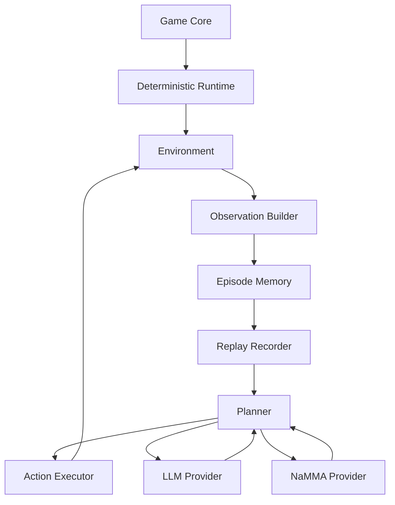

# NaMMA Runtime Architecture

Phase 6 defines the NaMMA Runtime as a game and device independent
control architecture. Rogue is the first target, but the same runtime
boundary should also support NetHack, Minecraft, ROS2, real robots, and
Accuvision-style devices.

This document is design only. It does not define implementation code,
Rogue source changes, headless APIs, `reset`, `step`, replay storage, or
provider implementations.

## Architecture Diagram

The diagram shows logical data flow. Implementations may call layers in
a tighter loop, but responsibilities should remain separate.

## Layer Summary

| Layer | Responsibility | Input | Output | Owned State |
| --- | --- | --- | --- | --- |
| Game Core | Own domain rules and authoritative state. | Executed action, seed, config | Game state, events | Game state, RNG state |
| Deterministic Runtime | Make execution repeatable and bounded. | Config, seed, action stream | Deterministic transition result | Seed plan, runtime counters |
| Environment | Present a control target to agents. | Validated action, reset request | Observation, result, terminal state | Episode lifecycle |
| Observation Builder | Convert game state into allowed views. | Game state, visibility rules | Agent observation, debug state | Observation schema version |
| Episode Memory | Maintain agent-side remembered context. | Observation, action result | Memory summary, plan context | Known map, history, plans |
| Replay Recorder | Persist reproducibility evidence. | Seeds, observations, actions, metadata | Replay record | Replay index, checksums |
| Planner | Choose goals or semantic actions. | Observation, memory, provider result | Requested action or plan | Planning context |
| Action Executor | Convert plans into executable actions. | Plan, memory, observation | Validated action | Path and retry state |
| LLM Provider | Produce language or structured plans. | Provider request | Provider response | Provider session metadata |
| NaMMA Provider | Produce hardware-backed plans. | Provider request | Provider response | Capability and transport state |

## Layer Definitions

### Game Core

Responsibility:

- Own the authoritative domain state.
- Apply rules for movement, combat, items, physics, devices, or robots.
- Keep domain-specific random behavior inside the deterministic boundary.

Input:

- Executed action.
- Seeded runtime context.
- Game or device configuration.

Output:

- Updated game state.
- Domain events.
- Terminal condition candidates.

State:

- Full internal state.
- Random generator state.
- Domain-only flags not visible to normal agents.

### Deterministic Runtime

Responsibility:

- Bind game execution to explicit seeds, configuration, and action order.
- Separate pristine upstream behavior from runtime control mechanics.
- Provide the reproducibility boundary for replay and evaluation.

Input:

- World seed.
- Episode seed.
- Replay seed when replaying.
- Runtime configuration.
- Ordered executed actions.

Output:

- Deterministic transition results.
- Runtime errors.
- Timing and performance counters.

State:

- Seed registry.
- Turn counter.
- Runtime state machine state.
- Determinism checksums when available.

### Environment

Responsibility:

- Expose a control target to agents without exposing private internals.
- Own episode start, pause, finish, failure, and timeout behavior.
- Call the observation builder and action executor boundaries.

Input:

- Validated action.
- Episode control command.
- Runtime configuration.

Output:

- Agent observation.
- Action result.
- Episode status.
- Optional privileged debug state for tests only.

State:

- Episode ID.
- Turn number.
- Terminal reason.
- Last action result.

### Observation Builder

Responsibility:

- Convert game state into an agent-facing observation.
- Keep `Game State`, `Observation`, `Debug State`, and `Episode Memory`
  separate.
- Prevent hidden state leakage.

Input:

- Current game state.
- Visibility rules.
- Observation schema version.
- Debug mode setting.

Output:

- `AgentObservation`.
- Optional `PrivilegedDebugState` for validation and replay tooling.

State:

- Schema version.
- Visibility policy.
- Redaction policy.

### Episode Memory

Responsibility:

- Store what the agent has learned from past observations.
- Support planning, exploration, loop detection, and retry.
- Remain outside the environment's authoritative game state.

Input:

- Observation sequence.
- Action results.
- Planner notes.

Output:

- Memory summary.
- Known targets.
- Failed targets.
- Plan context.

State:

- Known map.
- Visited cells or states.
- Known resources.
- Current plan.
- Loop and failure history.

### Replay Recorder

Responsibility:

- Capture enough data to inspect, compare, and reproduce episodes.
- Keep replay evidence separate from normal agent observation.
- Support both deterministic replay and diagnostic replay modes.

Input:

- Runtime metadata.
- Seeds.
- Actions.
- Observations.
- Optional snapshots.
- Provider requests and responses when permitted.

Output:

- Replay record.
- Replay index.
- Episode summary.

State:

- Replay writer state.
- Checksum chain.
- Storage policy.

### Planner

Responsibility:

- Decide goals, high-level plans, or semantic actions.
- Use observation and memory, not hidden debug state.
- Call providers through a common provider interface.

Input:

- Agent observation.
- Episode memory summary.
- Provider capability information.
- Runtime budget.

Output:

- Requested action.
- Plan.
- Replan reason.

State:

- Planning horizon.
- Prompt or structured task context.
- Provider selection policy.

### Action Executor

Responsibility:

- Convert requested actions or plans into validated executable actions.
- Reject malformed actions without leaking hidden information.
- Keep deterministic tactical logic separate from provider reasoning.

Input:

- Requested action.
- Current observation.
- Episode memory.
- Action schema.

Output:

- Validated action.
- Executed action request.
- Rejection reason.

State:

- Current path.
- Retry counters.
- Last validation errors.

### LLM Provider

Responsibility:

- Produce plans or semantic actions from a provider request.
- Hide provider-specific HTTP, server, token, or model details behind a
  common interface.

Input:

- Provider request.
- Timeout budget.
- Capability request.

Output:

- Provider response.
- Provider error.
- Usage and latency metadata.

State:

- Endpoint configuration.
- Model selection.
- Session metadata when needed.

### NaMMA Provider

Responsibility:

- Expose NaMMA as the same application-level provider shape as Human,
  Rule Based, LLM, and Replay providers.
- Keep Ethernet, OCuLink, PCIe, and future transports below the provider
  interface.

Input:

- Provider request.
- Timeout budget.
- Capability request.

Output:

- Provider response.
- Provider error.
- Capability report.

State:

- Transport status.
- Capability cache.
- Request and completion tracking.

## Runtime Boundaries

The most important boundary is between authoritative state and agent
state:

- `Game State` is internal and authoritative.
- `Observation` is a redacted current view.
- `Episode Memory` is built by the agent from past observations.
- `Debug State` is privileged and never sent to normal providers.

The second most important boundary is between provider planning and
action execution:

- Providers may propose goals, plans, or semantic actions.
- The Action Executor validates and executes one runtime action at a
  time.
- Hidden state must not be leaked through validation or legal action
  generation.

## Configuration Categories

Game:

- Game or device type.
- Source version or firmware version.
- Domain rule configuration.

Runtime:

- Determinism mode.
- Timeout policy.
- Runtime state machine policy.

Provider:

- Provider type.
- Endpoint or transport profile.
- Capability requirements.

Replay:

- Replay mode.
- Storage level.
- Snapshot interval.

Debug:

- Privileged state recording policy.
- Extra checksums.
- Diagnostic logging.

## Logging Categories

Game:

- Domain events.
- Terminal events.

Runtime:

- State transitions.
- Seeds.
- Episode lifecycle.

Replay:

- Replay writer events.
- Checksum chain.

Provider:

- Request IDs.
- Provider status.
- Latency and errors.

Performance:

- Turn time.
- Observation time.
- Provider time.
- Action time.
- Runtime time.

Debug:

- Privileged diagnostics.
- Invariant failures.

## Performance Measurements

Minimum measurements:

- `turn_time`: total elapsed time for one control turn.
- `observation_time`: time spent building agent observation.
- `provider_time`: time spent waiting for Human, Rule Based, LLM,
  NaMMA, or Replay provider output.
- `action_time`: time spent validating and applying an action.
- `runtime_time`: deterministic runtime overhead excluding provider
  latency when possible.

## Design Constraints

- Runtime interfaces must not be Rogue-specific.
- Rogue-specific fields may exist inside Rogue adapters only.
- Transport selection must not change provider request semantics.
- Replay must be useful even when provider output is nondeterministic.
- Debug state must not be available to normal planners or providers.

## Open Questions

- Observation Format.
- Replay Binary Format.
- Compression.
- Transport.
- Shared Memory.
- FlatBuffer.
- JSON.
- Protocol Buffers.
- Capability negotiation schema.
- Provider streaming support.
- Snapshot interval policy.
