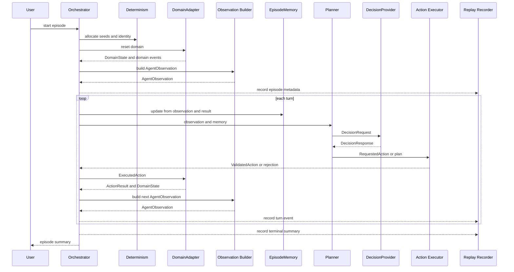
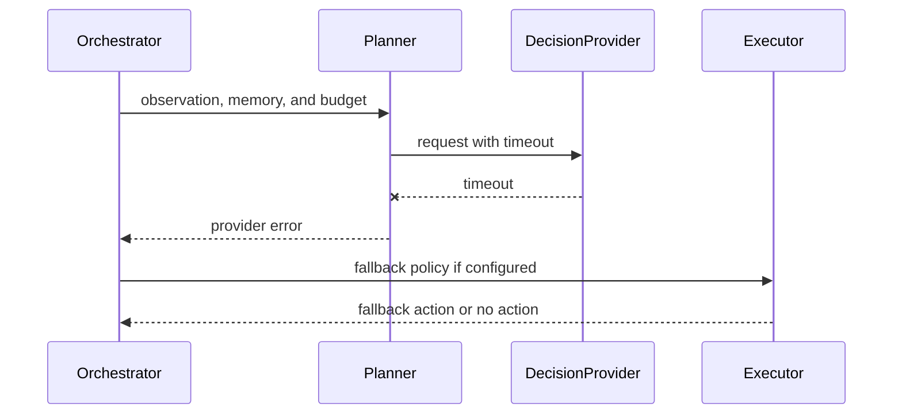

# Runtime Sequence

This document describes the high-level runtime sequence around
Runtime Orchestrator, DomainAdapter, DecisionProvider, Action Executor,
Replay Recorder, and Determinism Context. It is design only.

## Episode Sequence

Replay receives events from the Runtime Orchestrator. It is not in the
middle of the action path.

## Turn Sequence

One turn has these logical phases:

1. Receive current AgentObservation.
2. Update EpisodeMemory.
3. Build DecisionRequest.
4. Wait for DecisionProvider response or timeout.
5. Convert decision output to RequestedAction or plan.
6. Validate RequestedAction.
7. Submit ExecutedAction to DomainAdapter.
8. Receive ActionResult and DomainState.
9. Build next AgentObservation.
10. Emit replay events.
11. Check terminal condition and EpisodeOutcome.

## Provider Timeout Sequence

Timeout handling must be explicit. The runtime must never silently reuse
stale DecisionProvider output.

## Runtime Replay Mode Sequence

Runtime Replay Mode is not a DecisionProvider.

1. Load replay metadata.
2. Verify source and configuration identity.
3. Reconstruct Determinism Context.
4. Feed recorded ExecutedActions to the DomainAdapter.
5. Compare ActionResult values and checksums.
6. Compare terminal outcome.
7. Report first divergence.

## Pause And Resume Sequence

Pause:

- finish current atomic runtime operation,
- stop accepting new DecisionProvider requests,
- flush Replay Recorder,
- enter `PAUSED`.

Resume:

- confirm provider availability if needed,
- re-enter `RUNNING`,
- continue from the next turn boundary.

The runtime should not pause halfway through a domain state mutation.

## Sequence Open Questions

- Should provider requests be synchronous first, or should async be
  added later?
- Should replay compare every checksum by default?
- Should the runtime allow speculative provider requests in a future
  profile?
- How should real robot emergency stop map to runtime state?
