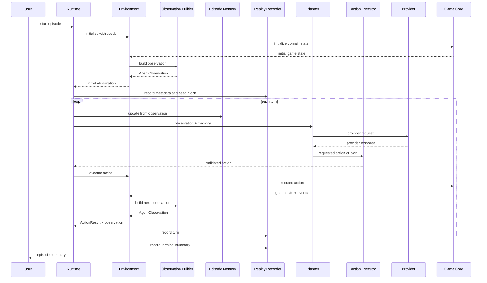
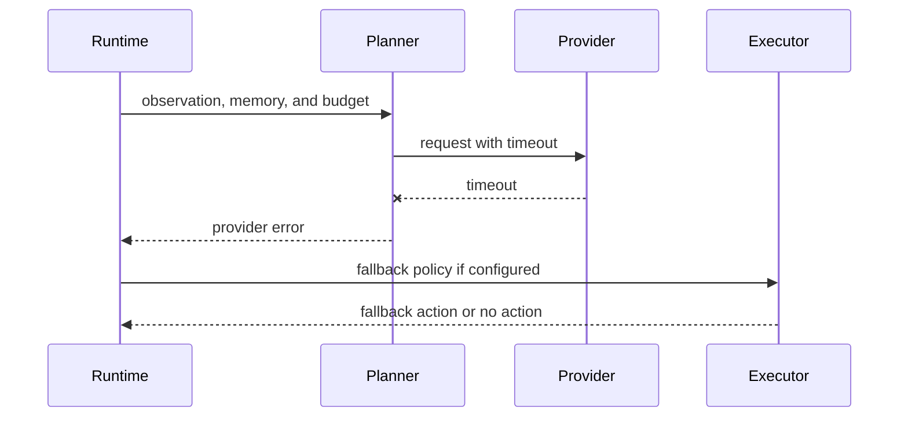

# Runtime Sequence

This document describes the expected high-level runtime sequence. It is
design only and does not implement runtime code.

## Episode Sequence

## Turn Sequence

One turn should have these logical phases:

1. Receive current observation.
2. Update episode memory.
3. Build provider request.
4. Wait for provider response or timeout.
5. Convert provider output to requested action or plan.
6. Validate requested action.
7. Execute validated action.
8. Build action result and next observation.
9. Record replay data.
10. Check terminal state.

## Provider Timeout Sequence

Timeout handling must be explicit. The runtime should not silently reuse
an old provider response unless that is a configured fallback policy and
is recorded in replay.

## Replay Sequence

Replay provider mode:

1. Load replay metadata.
2. Verify runtime and configuration compatibility.
3. Reconstruct seed plan.
4. Feed recorded actions or provider responses through the same provider
   interface.
5. Compare observations, hashes, and terminal result.
6. Report first divergence.

Replay must use the same Action Executor boundary as live operation.

## Pause And Resume Sequence

Pause:

- Finish current atomic runtime operation.
- Stop accepting new provider requests.
- Flush replay writer.
- Enter `PAUSED`.

Resume:

- Confirm provider availability if needed.
- Re-enter `RUNNING`.
- Continue from the next turn boundary.

The runtime should not pause halfway through a domain state mutation.

## Sequence Open Questions

- Should provider requests be synchronous first, or should async be
  required from the start?
- Should replay compare every observation or only hashes by default?
- Should the runtime allow speculative provider requests?
- How should real robot emergency stop integrate with `PAUSED` and
  `FAILED`?
