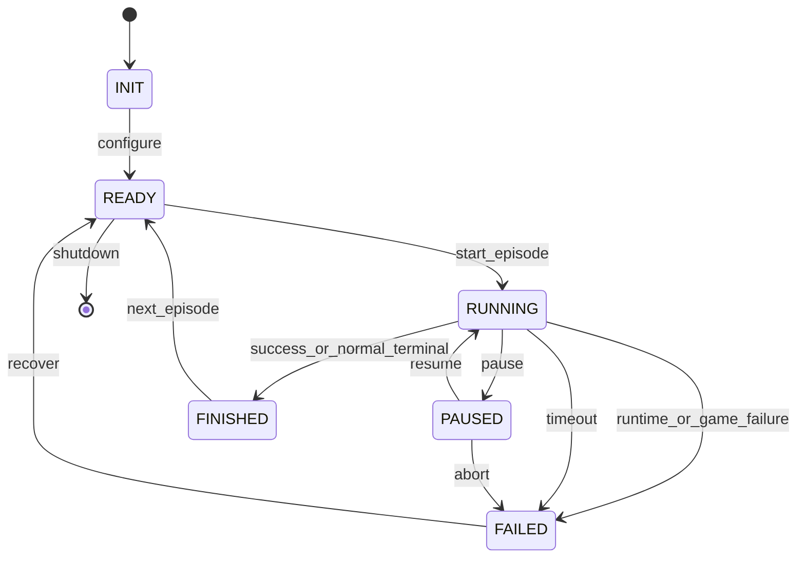

# Runtime State Machine

This document defines the NaMMA Runtime episode and process state
machine. It is design only and does not implement `reset`, `step`,
Replay, Observer, Agent, or NaMMA code.

## State Diagram

## States

| State | Meaning | Allowed Main Inputs | Main Outputs | Owned State |
| --- | --- | --- | --- | --- |
| `INIT` | Runtime is constructed but not configured. | Config load | Config validation result | Bootstrap state |
| `READY` | Runtime can start an episode. | Start request | Episode ID, seed plan | Provider capability cache |
| `RUNNING` | Episode is actively advancing turns. | Actions, pause, abort | Observations, action results | Turn state |
| `PAUSED` | Episode is intentionally suspended. | Resume, abort | Pause status | Suspended episode state |
| `FINISHED` | Episode reached a normal terminal result. | Next episode, shutdown | Episode summary | Terminal summary |
| `FAILED` | Episode or runtime failed abnormally. | Recover, shutdown | Failure report | Error context |

## Episode Start

An episode starts when the runtime leaves `READY` and enters `RUNNING`.
The runtime must assign:

- episode ID,
- world seed,
- episode seed,
- runtime configuration hash,
- provider profile,
- replay recording policy.

The first observation is produced after the game or device is initialized
for the episode. It must not include `EpisodeMemory` created by the
environment.

## Episode End

An episode ends when the runtime reaches `FINISHED` or `FAILED`.

`FINISHED` means the episode reached a defined terminal condition:

- success,
- game loss,
- normal user stop,
- replay completed,
- device task completed.

`FAILED` means the runtime could not continue safely:

- game error,
- runtime error,
- provider error,
- communication error,
- internal error,
- timeout that is classified as abnormal.

## Success, Failure, Interruption, And Timeout

Success:

- Domain-specific objective completed.
- For Rogue this can later mean returning with the amulet, but the
  runtime concept is generic.

Failure:

- Domain-specific loss condition.
- Runtime invariant failure.
- Provider failure that prevents a valid action.

Interrupted:

- Human or system requested stop before terminal success or loss.
- The episode should record the reason and last completed turn.

Timeout:

- A turn, provider call, episode, or communication operation exceeded
  its configured budget.
- Timeout may become `FAILED`, or it may produce a recoverable
  `ActionResult` if configured.

## Runtime Error Categories

Game Error:

- Domain engine could not apply a valid executed action.
- Domain state became invalid.

Runtime Error:

- State machine transition was invalid.
- Determinism boundary was violated.

Provider Error:

- Provider returned invalid output.
- Provider was unavailable.
- Provider exceeded its timeout.

Communication Error:

- Network, device, PCIe, shared memory, or protocol failure.

Internal Error:

- Bug in orchestration, schema handling, storage, or validation.

## State Transition Rules

- `INIT` may only move to `READY` after configuration is accepted.
- `READY` may start a new episode or shut down.
- `RUNNING` may produce observations and action results.
- `PAUSED` must not advance game time or device state unless the domain
  explicitly supports background time.
- `FINISHED` and `FAILED` are terminal for the current episode.
- Recovery creates a new episode context; it does not silently continue
  the failed one.

## Seed Handling Across States

World Seed:

- Defines the deterministic world or simulation baseline when the domain
  supports one.

Episode Seed:

- Defines per-episode randomness and must be recorded before the first
  action.

Replay Seed:

- Defines replay verification mode and must be paired with the recorded
  input or action sequence.

Seeds are part of the reproducibility boundary. If a domain cannot
control a seed, the runtime must mark that dimension as unavailable.

## State Machine Open Questions

- Should timeout always move to `FAILED`, or can some timeouts be
  recoverable action results?
- Should `PAUSED` allow provider requests to continue?
- Should replay verification use a separate `REPLAYING` state or a
  `RUNNING` mode flag?
- How should long-running robots or devices represent background time?
