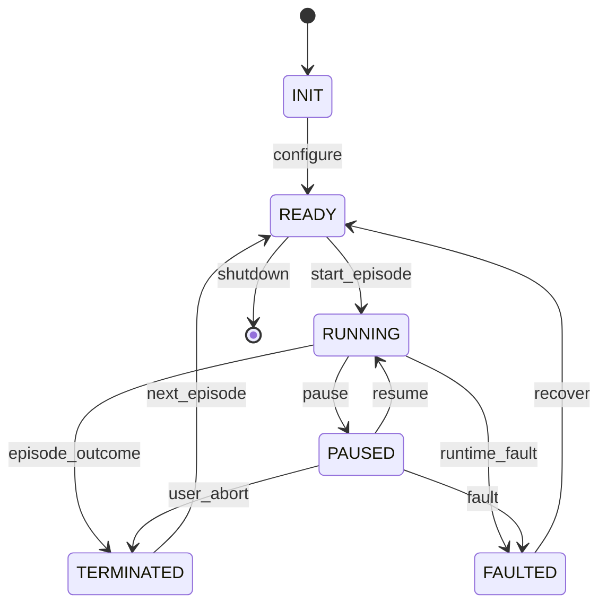

# Runtime State Machine

This document defines runtime states separately from episode outcomes.
It is design only and does not implement runtime code.

## Runtime State Diagram



## RuntimeState

```text
INIT
READY
RUNNING
PAUSED
TERMINATED
FAULTED
```

| State | Meaning | Owner |
| --- | --- | --- |
| `INIT` | Runtime exists but is not configured. | Runtime Orchestrator |
| `READY` | Runtime can start an episode. | Runtime Orchestrator |
| `RUNNING` | Episode is advancing turns. | Runtime Orchestrator |
| `PAUSED` | Episode is intentionally suspended. | Runtime Orchestrator |
| `TERMINATED` | Episode ended with an EpisodeOutcome. | Runtime Orchestrator |
| `FAULTED` | Runtime cannot safely continue. | Runtime Orchestrator |

## EpisodeOutcome

```text
SUCCESS
DOMAIN_LOSS
USER_ABORT
TIME_LIMIT
REPLAY_COMPLETE
```

`EpisodeOutcome` describes a completed episode. It is not the same as a
runtime fault.

For Rogue, player death is a normal episode termination with
`DOMAIN_LOSS`. It is not `FAULTED`.

## Fault Conditions

`FAULTED` is reserved for abnormal runtime conditions:

- DecisionProvider communication failure that cannot recover,
- internal invariant violation,
- DomainAdapter failure,
- replay verification infrastructure failure,
- storage failure that invalidates required replay evidence.

## Episode Start

An episode starts when the Runtime Orchestrator leaves `READY` and
enters `RUNNING`.

The Runtime Orchestrator assigns:

- episode ID,
- turn number,
- timeout policy,
- replay event stream,
- performance timing scope.

The Determinism Context supplies:

- world seed,
- episode seed,
- configuration hash,
- source and build identity,
- RNG stream identity.

## Episode End

An episode ends when the runtime enters `TERMINATED` or `FAULTED`.

`TERMINATED` requires one `EpisodeOutcome`.

`FAULTED` requires a structured runtime error.

## Timeout Handling

Timeout can mean different things:

- episode time limit reached: `TERMINATED` with `TIME_LIMIT`,
- DecisionProvider call exceeded budget: provider error or configured fallback,
- communication failure after timeout: possibly `FAULTED`,
- replay timeout: `FAULTED` if verification cannot continue.

The runtime must record which timeout policy was applied.

## Ownership Rules

The Runtime Orchestrator owns:

- runtime state machine,
- episode ID,
- turn number,
- DecisionProvider call lifecycle,
- timeout policy,
- episode outcome.

The DomainAdapter reports domain terminal conditions, but does not own
the runtime state machine.

The Determinism Context owns seed and checksum identity, but does not own
episode outcome.

## State Machine Open Questions

- Should `TIME_LIMIT` include both turn count and wall-clock limits?
- Should provider timeouts have a standardized fallback policy?
- Should replay verification have a separate state or a mode flag?
- How should real robot emergency stop map to `PAUSED`, `TERMINATED`,
  or `FAULTED`?
